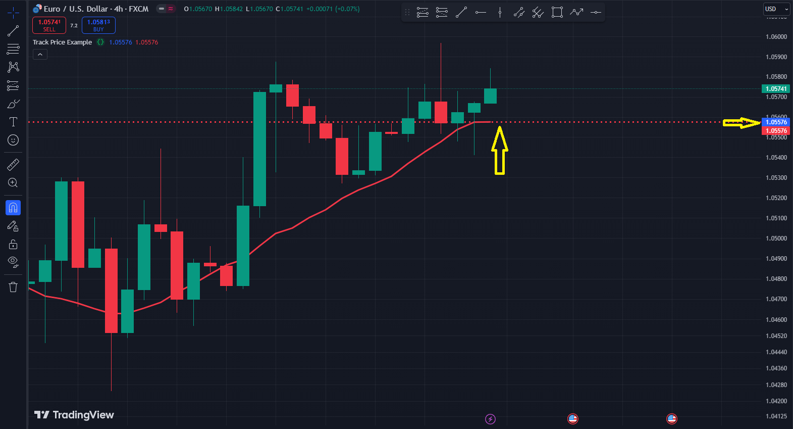
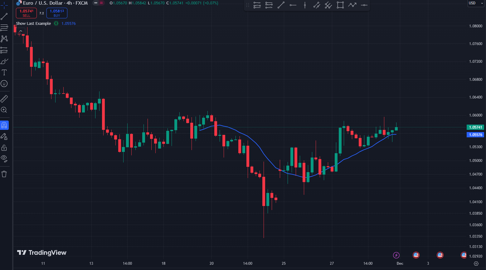

# plot

## Syntax:
```pine
plot(series, title, color, linewidth, style, trackprice, histbase, offset, join, editable, show_last, display, format, precision, force_overlay)
```
## series (series int/float) 
سری داده‌هایی که قرار است رسم شوند. آرگومان الزامی.

---

## title (const string) 
اسم پلات

---
## color (series color)
رنگ نمودار. می‌توانید از ثوابت مانند `color=color.red` یا `color=#ff001a` و همچنین عبارات پیچیده مانند `color = close >= open ? color.green : color.red` استفاده کنید. آرگومان اختیاری.

---
## linewidth (input int) 
عرض خط رسم شده. مقدار پیش‌فرض 1 است. برای هر استایل قابل اعمال نیست.

---
## style (input plot_style) 
نوع نمودار. مقادیر ممکن عبارتند از: `plot.style_line, plot.style_stepline, plot.style_stepline_diamond, plot.style_histogram, plot.style_cross, plot.style_area, plot.style_columns, plot.style_circles, plot.style_linebr, plot.style_areabr, plot.style_steplinebr`. مقدار پیش‌فرض `plot.style_line` است.

---
## trackprice (input bool) 
اگر `true` باشد، یک خط افقی قیمت در سطح آخرین مقدار اندیکاتور نمایش داده خواهد شد. مقدار پیش‌فرض `false` است.

در اینجا یک مثال ساده از `trackprice` آورده شده است:

```pine
//@version=6
indicator("Track Price Example", overlay=true)

// تعریف یک اندیکاتور ساده (میانگین متحرک ساده)
sma_value = ta.sma(close, 14)

// فعال کردن trackprice برای نشان دادن خط افقی در سطح آخرین مقدار SMA
plot(sma_value, trackprice=true, color=color.red, linewidth=1)
```
خروجی بصورت زیر است:




---
## histbase (input int/float) 
مقدار قیمت که به‌عنوان سطح مرجع هنگام رسم نمودار با استایل‌های `plot.style_histogram`، `plot.style_columns` یا `plot.style_area` استفاده می‌شود. مقدار پیش‌فرض 0.0 است.

---
## offset (simple int) 
نمودار را به تعداد مشخصی از کندل ها به سمت چپ یا راست جابه‌جا می‌کند. مقدار پیش‌فرض 0 است.

---
## join (input bool) 
اگر `true` باشد، نقاط نمودار با خط به هم متصل خواهند شد، که فقط برای استایل‌های `plot.style_cross` و `plot.style_circles` قابل اعمال است. مقدار پیش‌فرض `false` است.

---
## editable (const bool) 
اگر `true` باشد، استایل نمودار در پنجره تنظیمات قابل ویرایش خواهد بود. مقدار پیش‌فرض `true` است.

---
## show_last (input int) 
اگر تنظیم شود، تعداد کندل ها (از آخرین کندل به گذشته) که باید روی نمودار رسم شوند را تعریف می‌کند.

در اینجا یک مثال ساده از استفاده `show_last` در پاین اسکریپت آورده شده است:

```pine
//@version=6
indicator("Show Last Example", overlay=true)

// تعریف یک اندیکاتور ساده (میانگین متحرک ساده)
sma_value = ta.sma(close, 14)

// رسم نمودار با show_last
plot(sma_value, title="SMA", color=color.blue, linewidth=2, show_last=50)


```

خروجی بصورت زیر خواهد بود:



---
## display (input plot_display) 
کنترل می‌کند که اطلاعات نمودار کجا نمایش داده شود. گزینه‌های نمایش از جمع و تفریق پشتیبانی می‌کنند، به این معنی که استفاده از `display.all - display.status_line` اطلاعات نمودار را در همه جا به جز در خط وضعیت اسکریپت نمایش می‌دهد. `display.price_scale + display.status_line` نمودار را فقط در مقیاس قیمت و خط وضعیت نمایش می‌دهد. زمانی که آرگومان‌های نمایش مانند `display.price_scale` معادل‌هایی دارند که توسط کاربر تنظیم شده‌اند، اطلاعات مربوطه فقط زمانی ظاهر می‌شود که تمام تنظیمات اجازه آن را بدهند. مقادیر ممکن: `display.none, display.pane, display.data_window, display.price_scale, display.status_line`, `display.all`. 

اختیاری است.

 مقدار پیش‌فرض `display.all` است.

---
## format (input string) 
تعیین می‌کند که آیا اسکریپت مقادیر نمودار را به‌صورت قیمت، درصد یا مقادیر حجم فرمت می‌کند.

 > آرگومانی که به این پارامتر داده می‌شود، پارامتر فرمت اندیکاتور و توابع استراتژی را لغو می‌کند.
 
  اختیاری است.
  
   مقدار پیش‌فرض، *مقدار فرمت استفاده‌شده توسط اندیکاتور/استراتژی است.* مقادیر ممکن: `format.price, format.percent, format.volume`.

---
## precision (input int) 
تعداد ارقام بعد از اعشار که مقادیر نمودار در محور y پنل نمودار، خط وضعیت اسکریپت و پنجره داده‌ها نمایش می‌دهند. یک عدد صحیح غیرمنفی کمتر و یا برابر با 16 را می‌پذیرد. آرگومانی که به این پارامتر داده می‌شود، پارامتر `precision` اندیکاتور و توابع استراتژی را لغو می‌کند. زمانی که پارامتر فرمت تابع از `format.volume` استفاده می‌کند، پارامتر `precision` بر نتیجه تأثیری نخواهد داشت، زیرا قوانین دقت اعشاری تعریف‌شده توسط `format.volume` بر سایر تنظیمات دقت اولویت دارد. اختیاری است. مقدار پیش‌فرض، مقدار دقت استفاده‌شده توسط اندیکاتور/استراتژی است.

---
## force_overlay (const bool)

اگر `true` باشد، نتایج رسم‌شده در پنل اصلی نمودار نمایش داده می‌شوند، حتی زمانی که اسکریپت یک پنل جداگانه را اشغال کرده باشد. اختیاری است. مقدار پیش‌فرض `false` است.