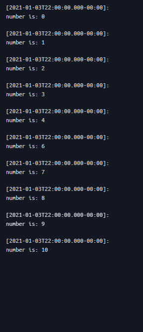
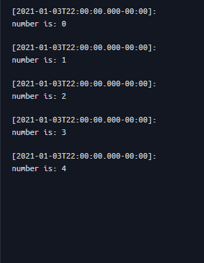

# if for while

## if Syntax:

```pine
result = condition ? value_if_true : value_if_false
```

---

## for Syntax:
```pine
//@version=6
indicator("for loop")

var check=true

if check
    for i= 0 to 10
        log.info("\n number is: {0}",i)
    check :=false

plot(na)
```

## while Syntax:

```pine
//@version=6
indicator("for loop")

var check=true

while check
    for i=0 to 10
        log.info("\n number is: "+str.tostring(i))
    check := false


plot(na)
```

## continue

```pine
//@version=6
indicator("for loop")

var number=0

while number <=10
    if number==5
        number+=1
        continue
        
    else
        log.info("\n number is: {0}",number)
        number+=1

plot(na)

```

خروجی



## break

```pine
//@version=6
indicator("for loop")

var number=0

while number <=10
    if number==5
        break
    else
        log.info("\n number is: {0}",number)
        number+=1

plot(na)

```

خروجی:

