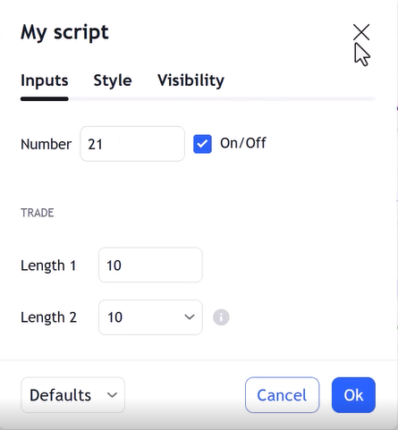

# input

ورودی گرفتن از کاربر

Syntax:
```pine
input(defval, title, tooltip, inline, group, display) → string,int,color,float,bool

```

## defval (const int/float/bool/string/color or source-type built-ins)
مقدار دیفالت که هر نوع داده ای میتواند باشد

---

## title (const string)
اسم ورودی

---

## tooltip (const string)

هنگام استفاده جلوی `input` یک `i`  نشان میدهد که با کلیک روی آن توضیحات نوشته شده ارائه میشود

---

## inline (const string)

برای خط بندی و تعیین اینکه کدام `input` ها در یک خط قرار بگیرند

---

## group (const string)

برای دسته بندی ورودی ها

---

## display (const plot_display)

در کدام قسمت ها نمایش داده شود

---

**code:**

```pine
//@version=6
indicator("input", overlay=true)

num1=input.int(21,"number",inline="1")
i_bool=input(true,"ON/Off",inline = "1")
i_len1=input.int(10,"len1",minval=4,maxval=22,step=2,group = "trade")
i_len2=input.int(10,"len2",options = [5,10,21,100],group = "trade",tooltip = "this is test")
i_len3=input.symbol("EURUSD","sym")

plot(na)

```

Export:




---
اگر نوع `input` را مشخص کنیم آرگمان های `minval, maxval, step, options` را میتوانیم استفاده کنیم